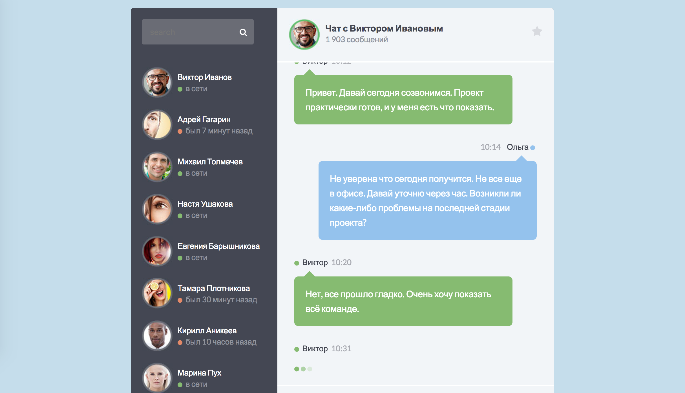

История сообщений в чате
===
Реализован один из компонентов чата — история сообщений:

## Данные

Список сообщений, передаваемый в компонент, представляет собой _массив объектов_, каждый из которых представляет собой сообщение, которое необходимо отразить в истории. Сообщение имеет следующие свойства:
- `id` — уникальный идентификатор сообщения, _строка_;
- `from` — автор сообщения, _объект_;
- `type` — тип сообщения, _строка_, варианты значений: `response`, `message`, `typing`;
- `time` — время публикации сообщения, _строка_;
- `text` — текст сообщения, _строка_, может отсутствовать.

## Описание компонента

Для отображения списка создан компонент `MessageHistory`, который принимает следующие атрибуты:
- `list` — список сообщений, _массив объектов_, по умолчанию пустой массив.

Если список сообщений пуст, то компонент не должен иметь какого-либо представления в DOM.

Каждый тег `<li>` — сообщение из массива. Для отображения сообщений в чате использованы следующие компоненты:
- `Message` — если тип сообщения равен `message`;
- `Response` — если тип сообщения равен `response`;
- `Typing` — если тип сообщения равен `typing`.

## Установка и запуск приложения на локальной машине:
1. `git clone https://github.com/IrinaSakhno/props-and-typescript.git` - клонировать репозиторий на свое устройство
2. `cd chat` - перейти в папку chat
3. `npm i` - установить зависимости
4. `npm run start` - запустить приложение в режиме разработчика

После этого приложение можно будет открыть по ссылке  [http://localhost:3000](http://localhost:3000) в Вашем браузере.