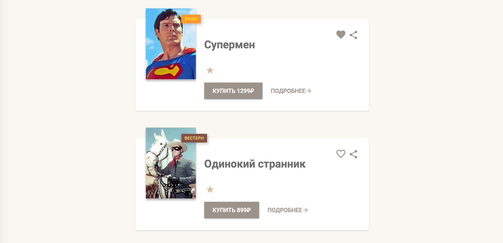

Рейтинг фильмов
===
Реализован компонент, отображающий рейтинг фильма в виде звёзд:

## Описание компонента

Для отображения рейтинга создан компонент `Stars`, который принимает следующие атрибуты:

- `count` — рейтинг фильма, _число_.

Если рейтинг меньше `1` или больше `5`, или вообще не число, то компонент не имеет какого-либо представления в
DOM.

Звёзды рейтинга представлены тегом `<ul>` с классом `card-body-stars`. Для отображения символа звезды внутри
тега `<li>` использован компонент `Star`.

## Установка и запуск приложения на локальной машине:
1. `git clone https://github.com/IrinaSakhno/props-and-typescript.git` - клонировать репозиторий на свое устройство
2. `cd films` - перейти в папку films
3. `npm i` - установить зависимости
4. `npm run start` - запустить приложение в режиме разработчика

После этого приложение можно будет открыть по ссылке  [http://localhost:3000](http://localhost:3000) в Вашем браузере.